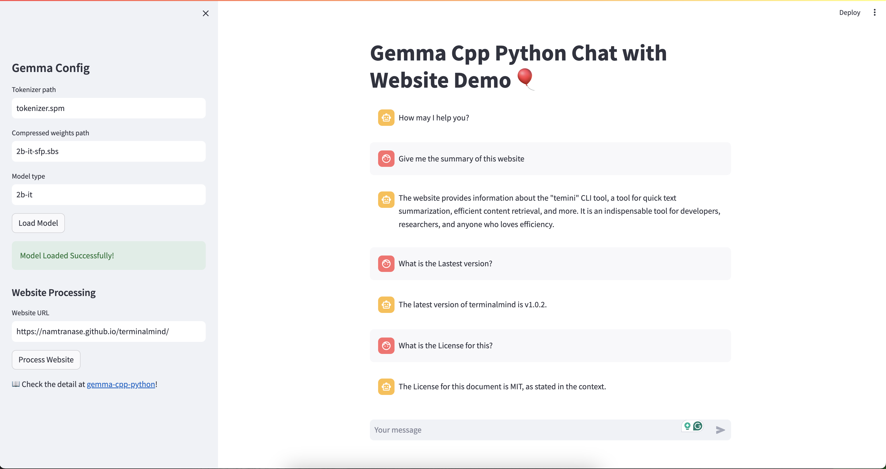

## 🌐 Chat with Website Feature

Gemma branches out into the web with our `Chat with Website` feature. Strike up a conversation with any website and let Gemma extract the essence for a delightful chat experience.

Special thank to the authors of repo: [scrapeGPT](https://github.com/LexiestLeszek/scrapeGPT), we based on scrapeGPT to build our demo!

### Quick Start

1. Launch the Gemma Chat Demo.
2. Plug in the tokenizer and weights paths, set the model type in the sidebar, and hit 'Load Model'.
3. Navigate to 'Website Processing', input a website URL, and press 'Process Website'.
4. Enjoy the interactive session as Gemma digests web content for a smart chat.

Dive into a seamless blend of AI interaction and web content with just a few clicks!

```bash
# To get started right away:
cd examples/webchat
pip install -r requirements.txt
streamlit run streamlit_webchat.py
```



